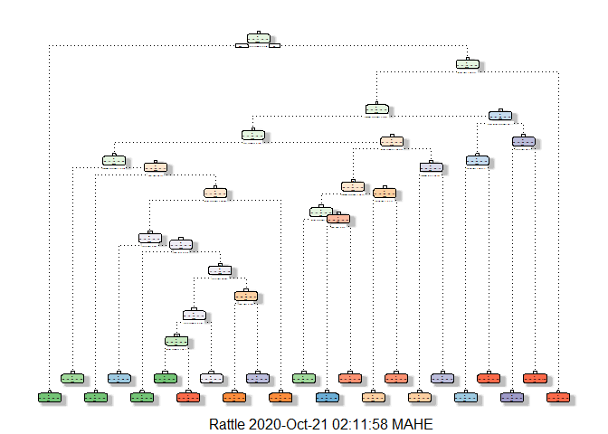
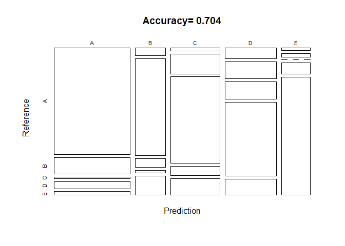
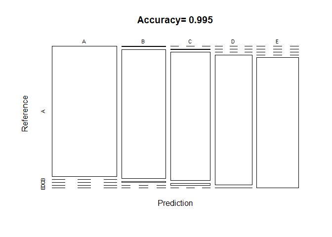
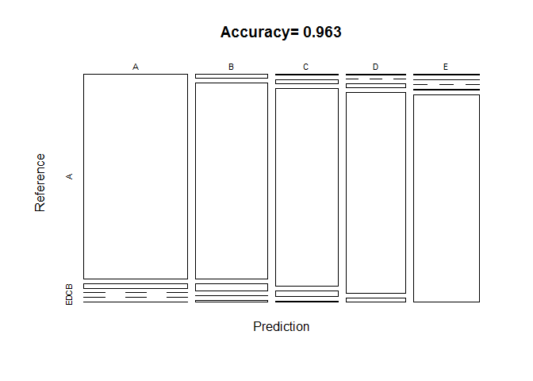

### Overview

Using devices such as Jawbone Up, Nike FuelBand, and Fitbit it is now
possible to collect a large amount of data about personal activity
relatively inexpensively. These type of devices are part of the
quantified self movement - a group of enthusiasts who take measurements
about themselves regularly to improve their health, to find patterns in
their behavior, or because they are tech geeks. One thing that people
regularly do is quantify how much of a particular activity they do, but
they rarely quantify how well they do it.

In this project, we will use data from accelerometers on the belt,
forearm, arm, and dumbell of 6 participants. They were asked to perform
barbell lifts correctly and incorrectly in 5 different ways.

The data consists of a Training data and a Test data (to be used to
validate the selected model).

The goal of this project is to predict the manner in which they did the
exercise. This is the “classe” variable in the training set.

### Loading The Required Packages

``` r
library(caret)
library(gbm)
library(rpart)
library(rpart.plot)
library(randomForest)
library(rattle)
```

### Reading the Data

``` r
# Reading the training dataset
train_data <-read.csv(url("https://d396qusza40orc.cloudfront.net/predmachlearn/pml-training.csv"),header=TRUE)
# Reading the test dataset
test_data <- read.csv(url("https://d396qusza40orc.cloudfront.net/predmachlearn/pml-testing.csv"),header=TRUE)
```

### Analyzing & Processing the Data

``` r
str(train_data)
```

    ## 'data.frame':    19622 obs. of  160 variables:
    ##  $ X                       : int  1 2 3 4 5 6 7 8 9 10 ...
    ##  $ user_name               : Factor w/ 6 levels "adelmo","carlitos",..: 2 2 2 2 2 2 2 2 2 2 ...
    ##  $ raw_timestamp_part_1    : int  1323084231 1323084231 1323084231 1323084232 1323084232 1323084232 1323084232 1323084232 1323084232 1323084232 ...
    ##  $ raw_timestamp_part_2    : int  788290 808298 820366 120339 196328 304277 368296 440390 484323 484434 ...
    ##  $ cvtd_timestamp          : Factor w/ 20 levels "02/12/2011 13:32",..: 9 9 9 9 9 9 9 9 9 9 ...
    ##  $ new_window              : Factor w/ 2 levels "no","yes": 1 1 1 1 1 1 1 1 1 1 ...
    ##  $ num_window              : int  11 11 11 12 12 12 12 12 12 12 ...
    ##  $ roll_belt               : num  1.41 1.41 1.42 1.48 1.48 1.45 1.42 1.42 1.43 1.45 ...
    ##  $ pitch_belt              : num  8.07 8.07 8.07 8.05 8.07 8.06 8.09 8.13 8.16 8.17 ...
    ##  $ yaw_belt                : num  -94.4 -94.4 -94.4 -94.4 -94.4 -94.4 -94.4 -94.4 -94.4 -94.4 ...
    ##  $ total_accel_belt        : int  3 3 3 3 3 3 3 3 3 3 ...
    ##  $ kurtosis_roll_belt      : Factor w/ 397 levels "","-0.016850",..: 1 1 1 1 1 1 1 1 1 1 ...
    ##  $ kurtosis_picth_belt     : Factor w/ 317 levels "","-0.021887",..: 1 1 1 1 1 1 1 1 1 1 ...
    ##  $ kurtosis_yaw_belt       : Factor w/ 2 levels "","#DIV/0!": 1 1 1 1 1 1 1 1 1 1 ...
    ##  $ skewness_roll_belt      : Factor w/ 395 levels "","-0.003095",..: 1 1 1 1 1 1 1 1 1 1 ...
    ##  $ skewness_roll_belt.1    : Factor w/ 338 levels "","-0.005928",..: 1 1 1 1 1 1 1 1 1 1 ...
    ##  $ skewness_yaw_belt       : Factor w/ 2 levels "","#DIV/0!": 1 1 1 1 1 1 1 1 1 1 ...
    ##  $ max_roll_belt           : num  NA NA NA NA NA NA NA NA NA NA ...
    ##  $ max_picth_belt          : int  NA NA NA NA NA NA NA NA NA NA ...
    ##  $ max_yaw_belt            : Factor w/ 68 levels "","-0.1","-0.2",..: 1 1 1 1 1 1 1 1 1 1 ...
    ##  $ min_roll_belt           : num  NA NA NA NA NA NA NA NA NA NA ...
    ##  $ min_pitch_belt          : int  NA NA NA NA NA NA NA NA NA NA ...
    ##  $ min_yaw_belt            : Factor w/ 68 levels "","-0.1","-0.2",..: 1 1 1 1 1 1 1 1 1 1 ...
    ##  $ amplitude_roll_belt     : num  NA NA NA NA NA NA NA NA NA NA ...
    ##  $ amplitude_pitch_belt    : int  NA NA NA NA NA NA NA NA NA NA ...
    ##  $ amplitude_yaw_belt      : Factor w/ 4 levels "","#DIV/0!","0.00",..: 1 1 1 1 1 1 1 1 1 1 ...
    ##  $ var_total_accel_belt    : num  NA NA NA NA NA NA NA NA NA NA ...
    ##  $ avg_roll_belt           : num  NA NA NA NA NA NA NA NA NA NA ...
    ##  $ stddev_roll_belt        : num  NA NA NA NA NA NA NA NA NA NA ...
    ##  $ var_roll_belt           : num  NA NA NA NA NA NA NA NA NA NA ...
    ##  $ avg_pitch_belt          : num  NA NA NA NA NA NA NA NA NA NA ...
    ##  $ stddev_pitch_belt       : num  NA NA NA NA NA NA NA NA NA NA ...
    ##  $ var_pitch_belt          : num  NA NA NA NA NA NA NA NA NA NA ...
    ##  $ avg_yaw_belt            : num  NA NA NA NA NA NA NA NA NA NA ...
    ##  $ stddev_yaw_belt         : num  NA NA NA NA NA NA NA NA NA NA ...
    ##  $ var_yaw_belt            : num  NA NA NA NA NA NA NA NA NA NA ...
    ##  $ gyros_belt_x            : num  0 0.02 0 0.02 0.02 0.02 0.02 0.02 0.02 0.03 ...
    ##  $ gyros_belt_y            : num  0 0 0 0 0.02 0 0 0 0 0 ...
    ##  $ gyros_belt_z            : num  -0.02 -0.02 -0.02 -0.03 -0.02 -0.02 -0.02 -0.02 -0.02 0 ...
    ##  $ accel_belt_x            : int  -21 -22 -20 -22 -21 -21 -22 -22 -20 -21 ...
    ##  $ accel_belt_y            : int  4 4 5 3 2 4 3 4 2 4 ...
    ##  $ accel_belt_z            : int  22 22 23 21 24 21 21 21 24 22 ...
    ##  $ magnet_belt_x           : int  -3 -7 -2 -6 -6 0 -4 -2 1 -3 ...
    ##  $ magnet_belt_y           : int  599 608 600 604 600 603 599 603 602 609 ...
    ##  $ magnet_belt_z           : int  -313 -311 -305 -310 -302 -312 -311 -313 -312 -308 ...
    ##  $ roll_arm                : num  -128 -128 -128 -128 -128 -128 -128 -128 -128 -128 ...
    ##  $ pitch_arm               : num  22.5 22.5 22.5 22.1 22.1 22 21.9 21.8 21.7 21.6 ...
    ##  $ yaw_arm                 : num  -161 -161 -161 -161 -161 -161 -161 -161 -161 -161 ...
    ##  $ total_accel_arm         : int  34 34 34 34 34 34 34 34 34 34 ...
    ##  $ var_accel_arm           : num  NA NA NA NA NA NA NA NA NA NA ...
    ##  $ avg_roll_arm            : num  NA NA NA NA NA NA NA NA NA NA ...
    ##  $ stddev_roll_arm         : num  NA NA NA NA NA NA NA NA NA NA ...
    ##  $ var_roll_arm            : num  NA NA NA NA NA NA NA NA NA NA ...
    ##  $ avg_pitch_arm           : num  NA NA NA NA NA NA NA NA NA NA ...
    ##  $ stddev_pitch_arm        : num  NA NA NA NA NA NA NA NA NA NA ...
    ##  $ var_pitch_arm           : num  NA NA NA NA NA NA NA NA NA NA ...
    ##  $ avg_yaw_arm             : num  NA NA NA NA NA NA NA NA NA NA ...
    ##  $ stddev_yaw_arm          : num  NA NA NA NA NA NA NA NA NA NA ...
    ##  $ var_yaw_arm             : num  NA NA NA NA NA NA NA NA NA NA ...
    ##  $ gyros_arm_x             : num  0 0.02 0.02 0.02 0 0.02 0 0.02 0.02 0.02 ...
    ##  $ gyros_arm_y             : num  0 -0.02 -0.02 -0.03 -0.03 -0.03 -0.03 -0.02 -0.03 -0.03 ...
    ##  $ gyros_arm_z             : num  -0.02 -0.02 -0.02 0.02 0 0 0 0 -0.02 -0.02 ...
    ##  $ accel_arm_x             : int  -288 -290 -289 -289 -289 -289 -289 -289 -288 -288 ...
    ##  $ accel_arm_y             : int  109 110 110 111 111 111 111 111 109 110 ...
    ##  $ accel_arm_z             : int  -123 -125 -126 -123 -123 -122 -125 -124 -122 -124 ...
    ##  $ magnet_arm_x            : int  -368 -369 -368 -372 -374 -369 -373 -372 -369 -376 ...
    ##  $ magnet_arm_y            : int  337 337 344 344 337 342 336 338 341 334 ...
    ##  $ magnet_arm_z            : int  516 513 513 512 506 513 509 510 518 516 ...
    ##  $ kurtosis_roll_arm       : Factor w/ 330 levels "","-0.02438",..: 1 1 1 1 1 1 1 1 1 1 ...
    ##  $ kurtosis_picth_arm      : Factor w/ 328 levels "","-0.00484",..: 1 1 1 1 1 1 1 1 1 1 ...
    ##  $ kurtosis_yaw_arm        : Factor w/ 395 levels "","-0.01548",..: 1 1 1 1 1 1 1 1 1 1 ...
    ##  $ skewness_roll_arm       : Factor w/ 331 levels "","-0.00051",..: 1 1 1 1 1 1 1 1 1 1 ...
    ##  $ skewness_pitch_arm      : Factor w/ 328 levels "","-0.00184",..: 1 1 1 1 1 1 1 1 1 1 ...
    ##  $ skewness_yaw_arm        : Factor w/ 395 levels "","-0.00311",..: 1 1 1 1 1 1 1 1 1 1 ...
    ##  $ max_roll_arm            : num  NA NA NA NA NA NA NA NA NA NA ...
    ##  $ max_picth_arm           : num  NA NA NA NA NA NA NA NA NA NA ...
    ##  $ max_yaw_arm             : int  NA NA NA NA NA NA NA NA NA NA ...
    ##  $ min_roll_arm            : num  NA NA NA NA NA NA NA NA NA NA ...
    ##  $ min_pitch_arm           : num  NA NA NA NA NA NA NA NA NA NA ...
    ##  $ min_yaw_arm             : int  NA NA NA NA NA NA NA NA NA NA ...
    ##  $ amplitude_roll_arm      : num  NA NA NA NA NA NA NA NA NA NA ...
    ##  $ amplitude_pitch_arm     : num  NA NA NA NA NA NA NA NA NA NA ...
    ##  $ amplitude_yaw_arm       : int  NA NA NA NA NA NA NA NA NA NA ...
    ##  $ roll_dumbbell           : num  13.1 13.1 12.9 13.4 13.4 ...
    ##  $ pitch_dumbbell          : num  -70.5 -70.6 -70.3 -70.4 -70.4 ...
    ##  $ yaw_dumbbell            : num  -84.9 -84.7 -85.1 -84.9 -84.9 ...
    ##  $ kurtosis_roll_dumbbell  : Factor w/ 398 levels "","-0.0035","-0.0073",..: 1 1 1 1 1 1 1 1 1 1 ...
    ##  $ kurtosis_picth_dumbbell : Factor w/ 401 levels "","-0.0163","-0.0233",..: 1 1 1 1 1 1 1 1 1 1 ...
    ##  $ kurtosis_yaw_dumbbell   : Factor w/ 2 levels "","#DIV/0!": 1 1 1 1 1 1 1 1 1 1 ...
    ##  $ skewness_roll_dumbbell  : Factor w/ 401 levels "","-0.0082","-0.0096",..: 1 1 1 1 1 1 1 1 1 1 ...
    ##  $ skewness_pitch_dumbbell : Factor w/ 402 levels "","-0.0053","-0.0084",..: 1 1 1 1 1 1 1 1 1 1 ...
    ##  $ skewness_yaw_dumbbell   : Factor w/ 2 levels "","#DIV/0!": 1 1 1 1 1 1 1 1 1 1 ...
    ##  $ max_roll_dumbbell       : num  NA NA NA NA NA NA NA NA NA NA ...
    ##  $ max_picth_dumbbell      : num  NA NA NA NA NA NA NA NA NA NA ...
    ##  $ max_yaw_dumbbell        : Factor w/ 73 levels "","-0.1","-0.2",..: 1 1 1 1 1 1 1 1 1 1 ...
    ##  $ min_roll_dumbbell       : num  NA NA NA NA NA NA NA NA NA NA ...
    ##  $ min_pitch_dumbbell      : num  NA NA NA NA NA NA NA NA NA NA ...
    ##  $ min_yaw_dumbbell        : Factor w/ 73 levels "","-0.1","-0.2",..: 1 1 1 1 1 1 1 1 1 1 ...
    ##  $ amplitude_roll_dumbbell : num  NA NA NA NA NA NA NA NA NA NA ...
    ##   [list output truncated]

``` r
# Calculating no of NAs in each column for training set
train_data_na_col<-sapply(train_data,function(x) sum(is.na(x)))
unique(train_data_na_col)
```

    ## [1]     0 19216

We observe that many columns of training dataset are filled with Na
values.Therefore we will remove such columns.

``` r
train_data_na_col<-train_data_na_col[train_data_na_col>0]
train_data_na_col_names<-which(names(train_data) %in% names(train_data_na_col))
train_data_cleaned<-train_data[,-train_data_na_col_names]
```

Next we will elimnate any variable with near zero variance as they are
not heplful to show correlation or causality.

``` r
train_data_nzv<-nearZeroVar(train_data_cleaned)
train_data_cleaned<-train_data_cleaned[,-train_data_nzv]
```

``` r
str(train_data_cleaned,list.len=7)
```

    ## 'data.frame':    19622 obs. of  59 variables:
    ##  $ X                   : int  1 2 3 4 5 6 7 8 9 10 ...
    ##  $ user_name           : Factor w/ 6 levels "adelmo","carlitos",..: 2 2 2 2 2 2 2 2 2 2 ...
    ##  $ raw_timestamp_part_1: int  1323084231 1323084231 1323084231 1323084232 1323084232 1323084232 1323084232 1323084232 1323084232 1323084232 ...
    ##  $ raw_timestamp_part_2: int  788290 808298 820366 120339 196328 304277 368296 440390 484323 484434 ...
    ##  $ cvtd_timestamp      : Factor w/ 20 levels "02/12/2011 13:32",..: 9 9 9 9 9 9 9 9 9 9 ...
    ##  $ num_window          : int  11 11 11 12 12 12 12 12 12 12 ...
    ##  $ roll_belt           : num  1.41 1.41 1.42 1.48 1.48 1.45 1.42 1.42 1.43 1.45 ...
    ##   [list output truncated]

The first 7 variables don’t have any significant impact on the
outcome,thus we are going to remove these columns

``` r
train_data_cleaned<-train_data_cleaned[,-c(1:7)]
```

Similary we will clean the test dataset

``` r
test_data_na_col<-sapply(test_data,function(x) sum(is.na(x)))
test_data_na_col<-test_data_na_col[test_data_na_col>0]
test_data_na_col_names<-which(names(test_data) %in% names(test_data_na_col))
test_data_cleaned<-test_data[,-test_data_na_col_names]
test_data_nzv<-nearZeroVar(test_data_cleaned)
test_data_cleaned<-test_data_cleaned[,-test_data_nzv]
test_data_cleaned<-test_data_cleaned[,-c(1:7)]
```

We will now partition the training dataset into two parts - 70% training
data and 30% test data.

``` r
set.seed(400)
train_part<- createDataPartition(train_data_cleaned$classe, p=0.70, list=FALSE)
train1_cleaned <- train_data_cleaned[train_part,]
test1_cleaned <- train_data_cleaned[-train_part,]
dim(train1_cleaned)
```

    ## [1] 13737    52

``` r
dim(test1_cleaned)
```

    ## [1] 5885   52

### Using Machine Learning Algorithms For Prediction

We will use 3 methods for modelling the data and choose the one with
highest accuracy for the quiz. These methods are: Decision Tree, Random
Forests & Generalized Boosted Model.  
We will use a Confusion Matrix to validate the dataset and then plot it
for better visualisation. \#\#\#\# Decision Tree

``` r
set.seed(400)
decision_tree <- rpart(classe ~ ., data=train1_cleaned, method="class")
fancyRpartPlot(decision_tree)
```

    ## Warning: labs do not fit even at cex 0.15, there may be some overplotting



We will now validate the results using the confusion matrix

``` r
predict_tree <- predict(decision_tree, test1_cleaned, type = "class")
confmat_dectree <- confusionMatrix(predict_tree, test1_cleaned$classe)
confmat_dectree
```

    ## Confusion Matrix and Statistics
    ## 
    ##           Reference
    ## Prediction    A    B    C    D    E
    ##          A 1490  232   24   99   51
    ##          B   43  544   50   15  109
    ##          C   25  183  786   85  152
    ##          D  103  162  166  706  153
    ##          E   13   18    0   59  617
    ## 
    ## Overall Statistics
    ##                                           
    ##                Accuracy : 0.704           
    ##                  95% CI : (0.6921, 0.7156)
    ##     No Information Rate : 0.2845          
    ##     P-Value [Acc > NIR] : < 2.2e-16       
    ##                                           
    ##                   Kappa : 0.6248          
    ##                                           
    ##  Mcnemar's Test P-Value : < 2.2e-16       
    ## 
    ## Statistics by Class:
    ## 
    ##                      Class: A Class: B Class: C Class: D Class: E
    ## Sensitivity            0.8901  0.47761   0.7661   0.7324   0.5702
    ## Specificity            0.9036  0.95428   0.9084   0.8813   0.9813
    ## Pos Pred Value         0.7859  0.71485   0.6385   0.5473   0.8727
    ## Neg Pred Value         0.9539  0.88388   0.9484   0.9439   0.9102
    ## Prevalence             0.2845  0.19354   0.1743   0.1638   0.1839
    ## Detection Rate         0.2532  0.09244   0.1336   0.1200   0.1048
    ## Detection Prevalence   0.3222  0.12931   0.2092   0.2192   0.1201
    ## Balanced Accuracy      0.8968  0.71594   0.8372   0.8068   0.7758

``` r
# Plotting the results of confusion matrix
dec_tree_accuracy_msg<-paste("Accuracy=",round(confmat_dectree$overall[1],digits = 3))
plot(confmat_dectree$table, col = confmat_dectree$byClass, main =dec_tree_accuracy_msg)
```



#### Random Forests

``` r
set.seed(400)
mod_fit_randfor <- randomForest(classe ~. , data=train1_cleaned)
prediction_randfor<- predict(mod_fit_randfor, test1_cleaned, type = "class")
```

Using confusion matrix to test the accuracy

``` r
confmat_randfor<-confusionMatrix(prediction_randfor,test1_cleaned$classe)
confmat_randfor
```

    ## Confusion Matrix and Statistics
    ## 
    ##           Reference
    ## Prediction    A    B    C    D    E
    ##          A 1672    0    0    0    0
    ##          B    2 1137   10    0    0
    ##          C    0    2 1016   15    0
    ##          D    0    0    0  949    3
    ##          E    0    0    0    0 1079
    ## 
    ## Overall Statistics
    ##                                           
    ##                Accuracy : 0.9946          
    ##                  95% CI : (0.9923, 0.9963)
    ##     No Information Rate : 0.2845          
    ##     P-Value [Acc > NIR] : < 2.2e-16       
    ##                                           
    ##                   Kappa : 0.9931          
    ##                                           
    ##  Mcnemar's Test P-Value : NA              
    ## 
    ## Statistics by Class:
    ## 
    ##                      Class: A Class: B Class: C Class: D Class: E
    ## Sensitivity            0.9988   0.9982   0.9903   0.9844   0.9972
    ## Specificity            1.0000   0.9975   0.9965   0.9994   1.0000
    ## Pos Pred Value         1.0000   0.9896   0.9835   0.9968   1.0000
    ## Neg Pred Value         0.9995   0.9996   0.9979   0.9970   0.9994
    ## Prevalence             0.2845   0.1935   0.1743   0.1638   0.1839
    ## Detection Rate         0.2841   0.1932   0.1726   0.1613   0.1833
    ## Detection Prevalence   0.2841   0.1952   0.1755   0.1618   0.1833
    ## Balanced Accuracy      0.9994   0.9979   0.9934   0.9919   0.9986

``` r
# Plotting the results of confusion matrix
randfor_accuracy_msg<-paste("Accuracy=",round(confmat_randfor$overall[1],digits = 3))
plot(confmat_randfor$table,col=confmat_randfor$byClass, main =randfor_accuracy_msg)
```



#### Generalized Boosted Model

``` r
set.seed(400)
control_gbm <- trainControl(method = "repeatedcv", number = 5, repeats = 1)
modelfit_gbm <- train(classe ~ ., data=train1_cleaned, method = "gbm",trControl=control_gbm, verbose = FALSE)
```

Using confusion matrix for validation with testset

``` r
prediction_gbm <- predict(modelfit_gbm, newdata=test1_cleaned)
confmat_gbm <- confusionMatrix(prediction_gbm, test1_cleaned$classe)
confmat_gbm
```

    ## Confusion Matrix and Statistics
    ## 
    ##           Reference
    ## Prediction    A    B    C    D    E
    ##          A 1645   35    0    0    4
    ##          B   22 1082   43    1   10
    ##          C    4   19  966   29    5
    ##          D    1    0   17  929   19
    ##          E    2    3    0    5 1044
    ## 
    ## Overall Statistics
    ##                                           
    ##                Accuracy : 0.9628          
    ##                  95% CI : (0.9576, 0.9675)
    ##     No Information Rate : 0.2845          
    ##     P-Value [Acc > NIR] : < 2.2e-16       
    ##                                           
    ##                   Kappa : 0.9529          
    ##                                           
    ##  Mcnemar's Test P-Value : 2.551e-05       
    ## 
    ## Statistics by Class:
    ## 
    ##                      Class: A Class: B Class: C Class: D Class: E
    ## Sensitivity            0.9827   0.9500   0.9415   0.9637   0.9649
    ## Specificity            0.9907   0.9840   0.9883   0.9925   0.9979
    ## Pos Pred Value         0.9768   0.9344   0.9443   0.9617   0.9905
    ## Neg Pred Value         0.9931   0.9879   0.9877   0.9929   0.9921
    ## Prevalence             0.2845   0.1935   0.1743   0.1638   0.1839
    ## Detection Rate         0.2795   0.1839   0.1641   0.1579   0.1774
    ## Detection Prevalence   0.2862   0.1968   0.1738   0.1641   0.1791
    ## Balanced Accuracy      0.9867   0.9670   0.9649   0.9781   0.9814

``` r
# Plotting the results of confusion matrix
gbm_accuracy_msg<-paste("Accuracy=",round(confmat_gbm$overall[1],digits = 3))
plot(confmat_gbm$table,col=confmat_gbm$byClass, main =gbm_accuracy_msg)
```



### Conclusion

The accuracy of the 3 ml algorithms are  
Decision Tree-\>70.4%  
Random forests-\>99.5%  
Generalized Boosted Model-\>96.3%  
Since the accuracy for random forests is highest,we will be using it for
the quiz predictions

``` r
predict_test<-predict(mod_fit_randfor,test_data_cleaned)
predict_test
```

    ##  1  2  3  4  5  6  7  8  9 10 11 12 13 14 15 16 17 18 19 20 
    ##  B  A  B  A  A  E  D  B  A  A  B  C  B  A  E  E  A  B  B  B 
    ## Levels: A B C D E
